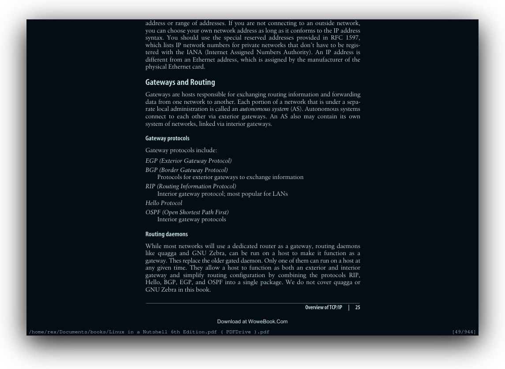

   
 <h1 align="center">
	 
	Articblush Zathura</a>
  </h1>

 <h3 align="center">A cold & comfy theme for Zathuar using articblush!</h3>

## Installation 
- `git clone https://github.com/articblush/zathura`. 
- `mv ~/path/to/cloned_dir/theme/zathurarc`. 
- And restart the program. 
